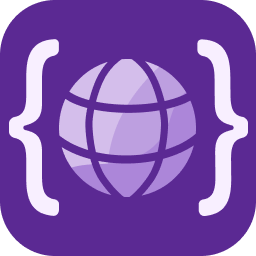

<div align="center">
  
  <h1>js-i18n.nvim</h1>
  <b>English</b> | <a href="./docs/README-ja.md">日本語(原文|Original)</a>
</div>

<br/>

**JavaScript/TypeScript i18n library support for Neovim**. powered by [nabekou29/js-i18n-language-server](https://github.com/nabekou29/js-i18n-language-server).

[](LICENSE) [](https://github.com/nabekou29/js-i18n.nvim/releases/latest) [](https://github.com/nabekou29/js-i18n.nvim/actions/workflows/test.yaml)

### Supported Libraries

- [i18next](https://www.i18next.com/) / [react-i18next](https://react.i18next.com/)
- [next-intl](https://next-intl-docs.vercel.app/)

## ✨ Features

- **Inline translation display** -- See translation values directly in your code as virtual text
- **Translation diagnostics** -- Detect missing and unused translation keys
- **Completion** -- Auto-complete translation keys as you type
- **Hover** -- View all translation values by hovering over a key
- **Go to definition** -- Jump to the key definition in JSON translation files
- **Find references** -- Find all usages of a translation key in source code
- **Edit translations** -- Edit translation values from commands or code actions
- **Copy key** -- Copy the translation key at cursor to clipboard
- **Delete unused keys** -- Remove translation keys not referenced in code

## Demo

<video src="https://github.com/user-attachments/assets/11bd0e3a-181d-4fe1-af36-5d8e78ea2fd0" ></video>

#### i18next / react-i18next


#### next-intl


## ✅ Requirements

- Neovim >= 0.11
- [js-i18n-language-server](https://github.com/nabekou29/js-i18n-language-server)

  ```sh
  npm install -g js-i18n-language-server
  ```

  Alternatively, you can skip the global install and use `npx` by setting the server command in your config:

  ```lua
  opts = {
    server = {
      cmd = { "npx", "-y", "js-i18n-language-server" },
    },
  }
  ```

## 📦 Installation

### [lazy.nvim](https://github.com/folke/lazy.nvim)

```lua
{
  "nabekou29/js-i18n.nvim",
  event = { "BufReadPre", "BufNewFile" },
  opts = {},
}
```

## 📚 Usage

### Commands

- `:I18nSetLang [lang]` - Sets the language. The set language is used for virtual text display and definition jumps.

- `:I18nEditTranslation [lang]` - Edits the translation at the cursor position. If there is no matching translation for the key, a new translation is added.
  If `lang` is omitted, the currently displayed language is used.

- `:I18nVirtualTextEnable` - Enables the display of virtual text.

- `:I18nVirtualTextDisable` - Disables the display of virtual text.

- `:I18nVirtualTextToggle` - Toggles the display of virtual text.

- `:I18nCopyKey` - Copies the translation key at the cursor position to the clipboard.

- `:I18nDeleteUnusedKeys` - Deletes unused translation keys from the current JSON file.

## ⚙️ Configuration

The default settings are as follows. For the complete list, refer to [config.lua](./lua/js-i18n/config.lua).

```lua
{
  -- Client-side (Neovim-specific) settings
  virt_text = {
    enabled = true,        -- Enable virtual text display
    format = ...,          -- Format function for virtual text
    conceal_key = false,   -- Hide keys and display only translations
    max_length = 0,        -- Max character length (0 = unlimited)
    max_width = 0,         -- Max display width (0 = unlimited)
  },

  -- Server settings
  -- Can also be configured via .js-i18n.json file (which takes priority)
  server = {
    cmd = { "js-i18n-language-server" },  -- Server command
    translation_files = { file_pattern = "**/{locales,messages}/**/*.json" },
    key_separator = ".",
    namespace_separator = nil,
    default_namespace = nil,
    primary_languages = nil,
    required_languages = nil,
    optional_languages = nil,
    diagnostics = { unused_keys = true },
  },
}
```

For server-side configuration details, see the [js-i18n-language-server configuration docs](https://github.com/nabekou29/js-i18n-language-server/blob/main/docs/configuration.md).

### Handling Flattened JSON

When using flattened JSON (e.g., `{ "some.deeply.nested.key": "value" }`), you can handle it by setting `key_separator` to a character that is not normally used.

```lua
{
  server = {
    key_separator = "?",  -- or "__no_separate__", or any character not included in your keys
  },
}
```

This will treat dot-separated keys as a single key instead of nested keys.

## ⬆️ Migration from v0.x

v1.0 has been rewritten to use the external [js-i18n-language-server](https://github.com/nabekou29/js-i18n-language-server).

### Key Changes

- **Dependencies**: `nvim-lspconfig`, `nvim-treesitter`, `plenary.nvim`, and `jq` are no longer required
- **Requirements**: `js-i18n-language-server` must be installed
- **Configuration**: Server-related settings have moved into the `server` table

Deprecated config keys are automatically converted and a warning is displayed.

```lua
-- v0.x
{
  primary_language = { "ja" },
  translation_source = { "**/locales/*.json" },
  key_separator = ".",
}

-- v1.0
{
  server = {
    primary_languages = { "ja" },
    translation_files = { file_pattern = "**/locales/*.json" },
    key_separator = ".",
  },
}
```
