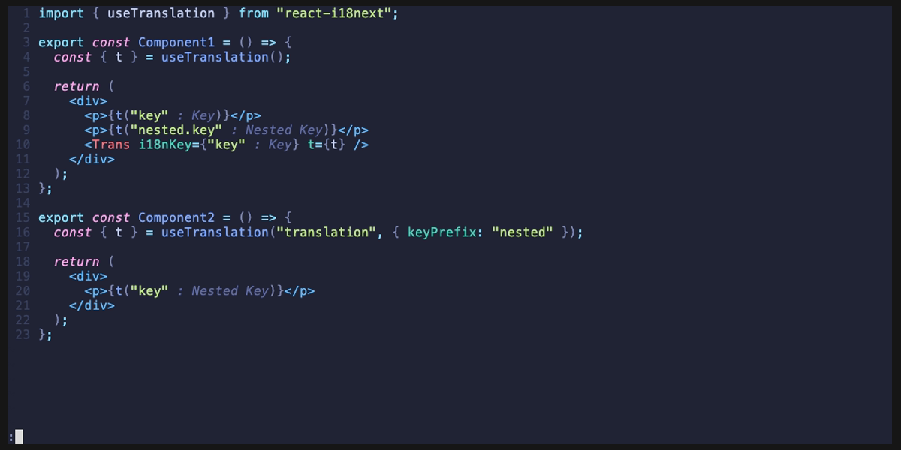
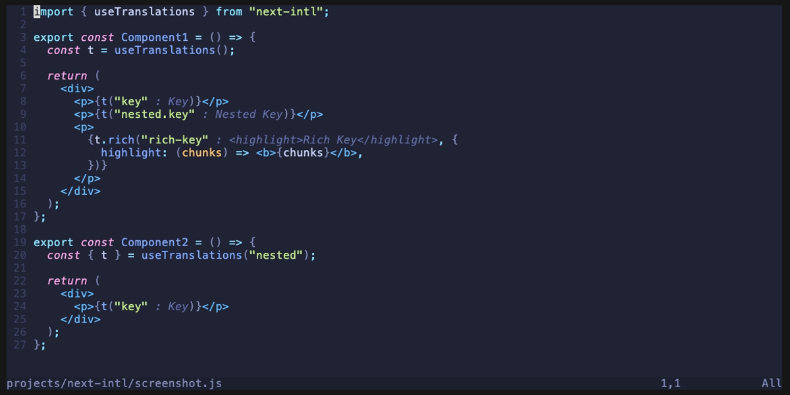

<div align="center">
    <a href="../README.md">English</a> | <b>日本語(原文|Original)</b>
</div>

# 🌐 js-i18n.nvim

[](https://github.com/nabekou29/js-i18n.nvim/releases/latest)
[](https://github.com/nabekou29/js-i18n.nvim/actions/workflows/test.yaml)

js-i18n.nvim は、[js-i18n-language-server](https://github.com/nabekou29/js-i18n-language-server) を利用した Neovim プラグインです。JavaScript/TypeScript の i18n ライブラリをサポートします。

<div>
  <video src="./assets/js-i18n.mp4" type="video/mp4" />
</div>

## ✨ 機能

- 翻訳をバーチャルテキストとして表示
- 翻訳の編集 (コマンド or コードアクション)
- 翻訳が不足している場合のエラー表示
- 未使用の翻訳キーの検出
- 定義ジャンプ
- ホバーによる翻訳の表示
- キーの補完
- 参照の検索
- いくつかのライブラリのサポート (i18next, react-i18next, next-intl)

### サポートしているライブラリ

#### [i18next](https://www.i18next.com/), [react-i18next](https://react.i18next.com/)



#### [next-intl](https://next-intl-docs.vercel.app/)



## ✅ 必須条件

- Neovim >= 0.11
- [js-i18n-language-server](https://github.com/nabekou29/js-i18n-language-server)

  ```sh
  npm install -g js-i18n-language-server
  ```

## 📦 インストール

### [lazy.nvim](https://github.com/folke/lazy.nvim)

```lua
{
  "nabekou29/js-i18n.nvim",
  event = { "BufReadPre", "BufNewFile" },
  opts = {},
}
```

## 📚 使い方

### コマンド

- `:I18nSetLang [lang]` - 言語を設定します。設定された言語はバーチャルテキストの表示や定義ジャンプに使用されます。

- `:I18nEditTranslation [lang]` - カーソルがある位置の翻訳を編集します。キーにマッチする翻訳がない場合は、新しい翻訳を追加します。
  `lang` を省略した場合は、現在表示されている言語を使用します。

- `:I18nVirtualTextEnable` - バーチャルテキストの表示を有効にします。

- `:I18nVirtualTextDisable` - バーチャルテキストの表示を無効にします。

- `:I18nVirtualTextToggle` - バーチャルテキストの表示を切り替えます。

- `:I18nCopyKey` - カーソル位置の翻訳キーをクリップボードにコピーします。

- `:I18nDeleteUnusedKeys` - 現在の JSON ファイルから未使用の翻訳キーを削除します。

## ⚙️ 設定

デフォルトの設定は以下の通りです。
完全な設定の一覧は [config.lua](../lua/js-i18n/config.lua) を参照してください。

```lua
{
  -- クライアント側（Neovim 固有）の設定
  virt_text = {
    enabled = true,        -- バーチャルテキストの表示を有効にする
    format = ...,          -- バーチャルテキストのフォーマット関数
    conceal_key = false,   -- キーを隠して翻訳のみを表示する
    max_length = 0,        -- 最大文字数 (0 = 無制限)
    max_width = 0,         -- 最大表示幅 (0 = 無制限)
  },

  -- サーバー設定
  -- .js-i18n.json ファイルでも設定可能（そちらが優先されます）
  server = {
    cmd = { "js-i18n-language-server" },  -- サーバーコマンド
    translation_files = { file_pattern = "**/{locales,messages}/**/*.json" },
    key_separator = ".",
    namespace_separator = nil,
    default_namespace = nil,
    primary_languages = nil,
    required_languages = nil,
    optional_languages = nil,
    diagnostics = { unused_keys = true },
  },
}
```

サーバー側の設定については [js-i18n-language-server の設定ドキュメント](https://github.com/nabekou29/js-i18n-language-server/blob/main/docs/configuration.md) を参照してください。

### フラット化されたJSONの扱い方

フラット化されたJSON（例: `{ "some.deeply.nested.key": "value" }`）を使用している場合は、`key_separator` を通常使用しない文字に設定することで対応できます。

```lua
{
  server = {
    key_separator = "?",  -- または "__no_separate__" など、キーに含まれない文字
  },
}
```

これにより、ドット区切りのキーがそのまま1つのキーとして扱われるようになります。

## ⬆️ v0.x からの移行

v1.0 では外部の [js-i18n-language-server](https://github.com/nabekou29/js-i18n-language-server) を利用する形に変更されました。

### 主な変更点

- **依存関係**: `nvim-lspconfig`, `nvim-treesitter`, `plenary.nvim`, `jq` が不要になりました
- **必須条件**: `js-i18n-language-server` のインストールが必要です
- **Neovim バージョン**: 0.11 以上が必要です
- **設定**: サーバー関連の設定は `server` テーブル内に移動しました

旧設定キーは自動的に新しいキーに変換され、警告が表示されます。

```lua
-- v0.x
{
  primary_language = { "ja" },
  translation_source = { "**/locales/*.json" },
  key_separator = ".",
}

-- v1.0
{
  server = {
    primary_languages = { "ja" },
    translation_files = { file_pattern = "**/locales/*.json" },
    key_separator = ".",
  },
}
```
