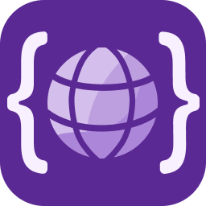
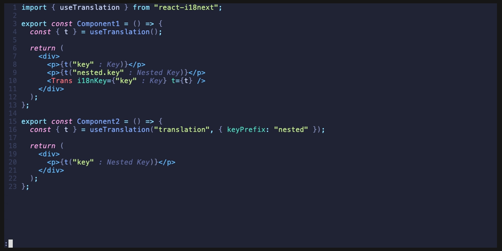
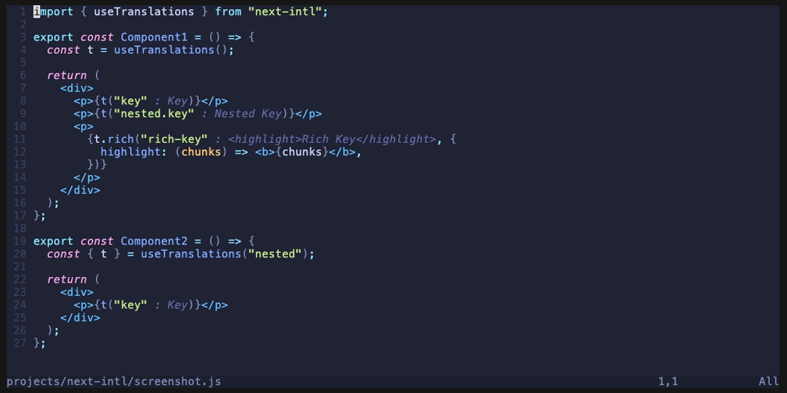

<div align="center">
  
  <h1>js-i18n.nvim</h1>
  <a href="../README.md">English</a> | <b>日本語(原文|Original)</b>
</div>

**Neovim 向けの JavaScript/TypeScript i18n ライブラリサポート**.
powered by [nabekou29/js-i18n-language-server](https://github.com/nabekou29/js-i18n-language-server).

[](LICENSE) [](https://github.com/nabekou29/js-i18n.nvim/releases/latest) [](https://github.com/nabekou29/js-i18n.nvim/actions/workflows/test.yaml)

### サポートしているライブラリ

- [i18next](https://www.i18next.com/) / [react-i18next](https://react.i18next.com/)
- [next-intl](https://next-intl-docs.vercel.app/)

## ✨ 機能

- **翻訳のインライン表示** -- 翻訳値をバーチャルテキストとしてコード上に直接表示
- **翻訳の診断** -- 不足している翻訳キーや未使用の翻訳キーを検出
- **補完** -- 翻訳キーを入力中に自動補完
- **ホバー** -- キーにカーソルを合わせて全言語の翻訳を表示
- **定義ジャンプ** -- JSON 翻訳ファイル内のキー定義にジャンプ
- **参照の検索** -- ソースコード内の翻訳キーの使用箇所をすべて検索
- **翻訳の編集** -- コマンドやコードアクションから翻訳値を編集
- **キーのコピー** -- カーソル位置の翻訳キーをクリップボードにコピー
- **未使用キーの削除** -- コードから参照されていない翻訳キーを削除

## Demo

<video src="https://github.com/user-attachments/assets/11bd0e3a-181d-4fe1-af36-5d8e78ea2fd0" ></video>

#### i18next / react-i18next



#### next-intl



## ✅ 必須条件

- Neovim >= 0.11
- [js-i18n-language-server](https://github.com/nabekou29/js-i18n-language-server)

  ```sh
  npm install -g js-i18n-language-server
  ```

  グローバルインストールせずに `npx` を使用することもできます。設定でサーバーコマンドを指定してください:

  ```lua
  opts = {
    server = {
      cmd = { "npx", "-y", "js-i18n-language-server" },
    },
  }
  ```

## 📦 インストール

### [lazy.nvim](https://github.com/folke/lazy.nvim)

```lua
{
  "nabekou29/js-i18n.nvim",
  event = { "BufReadPre", "BufNewFile" },
  opts = {},
}
```

## 📚 使い方

### コマンド

- `:I18nSetLang [lang]` - 言語を設定します。設定された言語はバーチャルテキストの表示や定義ジャンプに使用されます。

- `:I18nEditTranslation [lang]` - カーソルがある位置の翻訳を編集します。キーにマッチする翻訳がない場合は、新しい翻訳を追加します。
  `lang` を省略した場合は、現在表示されている言語を使用します。

- `:I18nVirtualTextEnable` - バーチャルテキストの表示を有効にします。

- `:I18nVirtualTextDisable` - バーチャルテキストの表示を無効にします。

- `:I18nVirtualTextToggle` - バーチャルテキストの表示を切り替えます。

- `:I18nCopyKey` - カーソル位置の翻訳キーをクリップボードにコピーします。

- `:I18nDeleteUnusedKeys` - 現在の JSON ファイルから未使用の翻訳キーを削除します。

## ⚙️ 設定

デフォルトの設定は以下の通りです。
完全な設定の一覧は [config.lua](../lua/js-i18n/config.lua) を参照してください。

```lua
{
  -- クライアント側（Neovim 固有）の設定
  virt_text = {
    enabled = true,        -- バーチャルテキストの表示を有効にする
    format = ...,          -- バーチャルテキストのフォーマット関数
    conceal_key = false,   -- キーを隠して翻訳のみを表示する
    max_length = 0,        -- 最大文字数 (0 = 無制限)
    max_width = 0,         -- 最大表示幅 (0 = 無制限)
  },

  -- サーバー設定
  -- .js-i18n.json ファイルでも設定可能（そちらが優先されます）
  server = {
    cmd = { "js-i18n-language-server" },  -- サーバーコマンド
    translation_files = {
      include_patterns = { "**/{locales,messages}/**/*.json" },
      exclude_patterns = {},
    },
    include_patterns = { "**/*.{js,jsx,ts,tsx,svelte,vue}" },  -- 解析対象のソースファイル
    exclude_patterns = { "node_modules/**" },
    key_separator = ".",
    namespace_separator = nil,
    default_namespace = nil,
    primary_languages = nil,
    diagnostics = {
      missing_translation = {
        enabled = true,
        severity = "warning",      -- "error" | "warning" | "information" | "hint"
        required_languages = nil,  -- 指定した言語のみチェックする（optional_languages と併用不可）
        optional_languages = nil,  -- 指定した言語をチェックしない（required_languages と併用不可）
      },
      unused_translation = {
        enabled = true,
        severity = "hint",
        ignore_patterns = {},      -- 無視するキーの glob パターン
      },
    },
    indexing = {
      num_threads = nil,  -- nil = CPU コア数の 40%
    },
    frameworks = {
      i18next = {
        prefer_selector = false,  -- `t(|)` の補完を `t(($) => $.key)`（Selector API）形式にする
      },
    },
  },
}
```

サーバー側の設定については [js-i18n-language-server の設定ドキュメント](https://github.com/nabekou29/js-i18n-language-server/blob/main/docs/configuration.md) を参照してください。

### フラット化されたJSONの扱い方

フラット化されたJSON（例: `{ "some.deeply.nested.key": "value" }`）を使用している場合は、`key_separator` を通常使用しない文字に設定することで対応できます。

```lua
{
  server = {
    key_separator = "?",  -- または "__no_separate__" など、キーに含まれない文字
  },
}
```

これにより、ドット区切りのキーがそのまま1つのキーとして扱われるようになります。

## ⬆️ v0.x からの移行

v1.0 では外部の [js-i18n-language-server](https://github.com/nabekou29/js-i18n-language-server) を利用する形に変更されました。

### 主な変更点

- **依存関係**: `nvim-lspconfig`, `nvim-treesitter`, `plenary.nvim`, `jq` が不要になりました
- **必須条件**: `js-i18n-language-server` のインストールが必要です
- **Neovim バージョン**: 0.11 以上が必要です
- **設定**: サーバー関連の設定は `server` テーブル内に移動しました

旧設定キーは自動的に新しいキーに変換され、警告が表示されます。

```lua
-- v0.x
{
  primary_language = { "ja" },
  translation_source = { "**/locales/*.json" },
  key_separator = ".",
}

-- v1.0
{
  server = {
    primary_languages = { "ja" },
    translation_files = { include_patterns = { "**/locales/*.json" } },
    key_separator = ".",
  },
}
```
